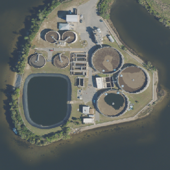
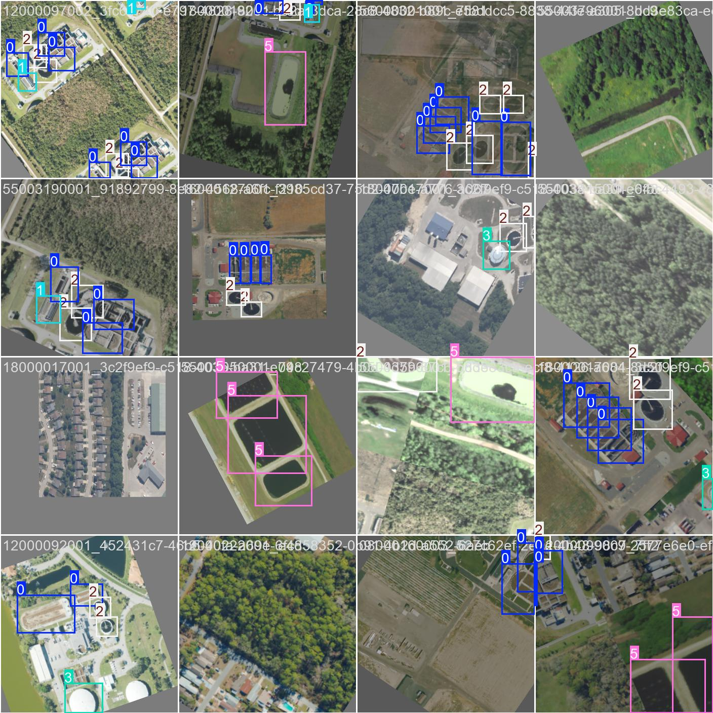

# Wastewater Plant Location Correction

**Detecting and correcting wrong facility coordinates by combining object
detection on aerial imagery with a geospatial machine-learning pipeline.**



*A wastewater treatment plant in NAIP aerial imagery — the circular clarifiers,
digesters, and ponds are exactly the infrastructure the model learns to find.*

Roughly **40% of the reported coordinates for U.S. wastewater treatment plants
are wrong** — they point to a city hall, a mailing address, or an empty field
instead of the plant. Wrong coordinates break every downstream use of the data:
mapping which communities a plant serves, linking wastewater-based disease
surveillance to real populations, and assessing infrastructure risk. This
project finds and fixes those errors at national scale.

It does so with two independent signals that cross-check each other:

1. **Computer vision on aerial imagery** *(this repo's centerpiece — see
   [`object_detection/`](object_detection))* — a **YOLOv8** detector trained to
   recognize treatment-plant infrastructure (clarifiers, aeration basins,
   digesters, drying beds, oxidation ponds, chlorine-contact tanks) directly in
   **NAIP** aerial imagery. Detected infrastructure gives a location grounded in
   what is physically visible, not in what was typed into a form.

2. **A tabular geospatial ML pipeline** *(supporting stage — see
   [`location_model/`](location_model))* — a two-stage tidymodels classifier that
   scores whether a reported coordinate is correct and, when it isn't, ranks
   nearby land parcels (gathered from **H3** hexagon rings) as candidate
   corrections.



*What the detector is trained to recognize: NAIP aerial tiles with ground-truth
annotations of treatment-plant infrastructure — circular **clarifiers** and
**digesters**, rectangular **aeration basins**, and **oxidation ponds** (pink).
The model is in active iteration; these are labeled training examples, not
predictions.*

## Results

| Component | Metric | Value |
|---|---|---|
| Object detector (`wwtp_v1`, round 1) | mAP@50 | **0.77** |
| Object detector (`wwtp_v1`, round 1) | mAP@50-95 | 0.40 |
| Object detector | train / val tiles | 124 / 58 (facility-level split) |
| Tabular Stage 1 (location correct?) | ROC AUC | **0.986** |
| Tabular Stage 2 (candidate parcel scoring) | ROC AUC | **0.975** |
| Coverage | scope | national — every CWNS plant; ~318k candidate parcels scored |

The object detector is an honest first-pass model on a small hand-annotated set,
in active iteration (round 2 adds hard negatives and a larger sample). The
tabular pipeline is the mature stage. See
[`object_detection/results/`](object_detection/results) and the
[results report](location_model/report/cwns_location_correction_report.qmd) for
curves, confusion matrices, and tier breakdowns.

## Tech stack

- **Computer vision:** PyTorch · Ultralytics **YOLOv8** · OpenCV · Label Studio
  (annotation) · object detection on 4-band (RGB+NIR) aerial imagery
- **Geospatial ML:** R · tidymodels (ranger / xgboost) · **sf** · **terra** ·
  **H3** hexagonal indexing · spatialsample (spatial cross-validation)
- **Data engineering:** **arrow / GeoParquet** · **DuckDB** · NAIP imagery via
  ArcGIS ImageServer · NDWI raster derivation · overlapping tile extraction
- **Reproducibility:** pinned dependencies · Dockerfile · pytest smoke tests ·
  GitHub Actions CI

## Repository layout

```
object_detection/     PyTorch/YOLOv8 module — dataset prep, training, inference (Python)
  prepare_dataset.py    facility-level train/val split from Label Studio exports
  train_model.py        YOLOv8s transfer learning with aerial-tuned augmentation
  infer.py              run the model; convert detections to geographic coordinates
  weights/best.pt       trained round-1 model
  results/              labeled training examples, PR curve, confusion matrix
  OVERVIEW.md           detailed methodology
  tests/                dependency-light smoke tests (run in CI)
location_model/       Two-stage tabular pipeline + H3 candidate scoring (R)
Dockerfile            reproducible CPU environment (prep / inference / tests)
.github/workflows/    CI: lint (ruff) + smoke tests
```

## Quickstart (object-detection module)

```bash
pip install -r object_detection/requirements.txt

# Run the trained model over a folder of NAIP RGB tiles
python object_detection/infer.py \
    --weights object_detection/weights/best.pt \
    --tiles path/to/rgb_tiles \
    --metadata tile_metadata.csv \
    --out detections.csv

# Reproduce dataset build + training from labeled tiles
python object_detection/prepare_dataset.py
python object_detection/train_model.py

# Tests
pytest object_detection/tests -q
# or, fully containerized:
docker build -t wwtp . && docker run --rm wwtp
```

## Why this matters beyond wastewater

The core problem here — **a national inventory of physical facilities whose
reported locations are unreliable, corrected by fusing remote-sensing imagery
with parcel/geospatial features** — is the same shape as most physical- and
environmental-risk intelligence work. The transferable pieces:

- **Object detection on satellite/aerial imagery** to locate and characterize
  built assets (the same approach applies to solar farms, tanks, mines,
  industrial sites, damage assessment).
- **H3 spatial indexing** for scalable candidate generation and spatial joins.
- **Imagery + tabular fusion** so predictions are cross-checked against
  independent evidence rather than trusting a single noisy source.
- **Production discipline** — reproducible environments, validated metrics, a
  tiered human-in-the-loop review path for low-confidence predictions.

## Data & compliance

- **NAIP imagery** is public (USDA). **CWNS** facility data is public (EPA).
- **Parcel boundaries (Regrid)** are licensed/commercial and are **not**
  distributed here — this repository describes methodology and ships code only,
  not parcel extracts. Bulk imagery, datasets, and training runs are
  `.gitignore`d; a few sample tiles and the trained weights are included for
  demonstration.
- The tabular stage was developed as part of an **EPA-org-hosted** effort
  (led/architected by the author); this personal repository is a code and
  methodology showcase and does not imply EPA endorsement.

## License

[MIT](LICENSE).
